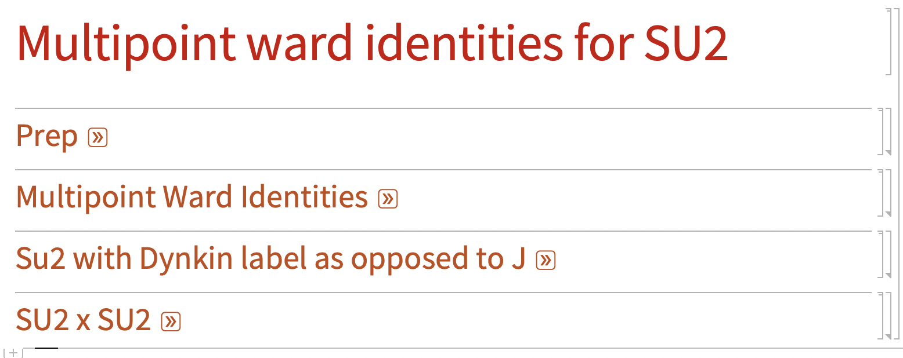

# Multipoint_Ward_identities
Derivation and implementation of Superconformal Ward Identities for line defect multipoint correlators via a topological twist -associated with publication 'On multipoint Ward identities for superconformal line defects'


# Superconformal Ward Identities for Line Defect Multipoint Correlators

This repository contains the **Wolfram Language (Mathematica)** code used to derive and verify the superconformal Ward identities for multipoint correlation functions of topological operators inserted on superconformal line defects, as described in the associated publication.

Read the full publication on [Journal of High Energy Physics]([https://link.springer.com/article/10.1007/JHEP04(2025)102]).

---

## Overview (Abstract)

Superconformal Ward identities are revisited in the context of superconformal line defects. Multipoint correlators of topological operators inserted on superconformal lines are studied. In particular, it is known that protected operators preserving enough of the supersymmetry become topological after performing a topological twist. By definition, such a correlator is constant in the topological limit. By  analysing the topological constraint on the OPE of such operators, the correlator is further constrained away from this limit. The constraints on multipoint correlators match the known superconformal Ward identities in the case of 4-point functions. This allows for an simple and universal derivation of the superconformal Ward identities governing the multipoint correlation functions of such operators. This concept is illustrated by 1/2-BPS operators with an su(2) R-symmetry and further explored in the case of the displacement multiplet on the 1/2-BPS Wilson line in 4d N = 4 super Yang-Mills theory supporting the conjectured multipoint Ward identities in the literature.

The code implements the algebra of the R-symmetry and the conformal symmetry as differential operators acting on the space and R#symmetry variables. Following the logic of the publication, it then linearises the topologically twisted Casimir equations to find differential equations satisfied by maximally supersymmetric insertions on the line defect. This approach should be generalisable to other groups than SU(2) as similar Ward Identities exist in N=4 SYM. A limit of these is tested in this example.

## Conclusions

In the simplest case of an R-symmetry group su(2), the Superconformal Ward identities simplify to linear combinations of differential operators acting on each of the cross-ratio, given in equation (2.36):


This was explicitly tested up to 12 insertion points.

---

##  Code and Implementation Details (Notebook Structure)

The core symbolic and analytical calculations are organized within the following **Wolfram Language (Mathematica) Notebook** sections. Each section corresponds to a step in the derivation and verification process:

* **Prep:** This section contains all necessary preliminary definitions, symbolic functions for the main calculations.
* **Multipoint Ward Identities:** This is the main body of the code, which utilizes **symbolic manipulation and expansion tools** to **derive the new Superconformal Ward Identities** governing $n>4$ point correlators this is tested up to n=12.
* **Su2 with Dynkin label as opposed to J:** This section focuses on the constraints on **$\frac{1}{2}$-BPS operators** with $su(2)$ R-symmetry. It includes the code for setting up and imposing the **Topological Constraint** on the OPE and functions to check the results against the well-established **4-point superconformal Ward identities**.
* **SU2 x SU2:** This final section provides the explicit verification for the specific case of the **Displacement Multiplet** on the $\frac{1}{2}$-BPS Wilson line in $4d\ \mathcal{N}=4$ SYM in the subsector bilinear su(2) sector of sp(4), supporting the conjectured multipoint Ward identities in the literature.



### Getting Started

The working implementation is currently written for the **Wolfram Language (Mathematica)**.

I am actively working on translating the core computational logic into an accessible **NumPy/SciPy** version to expand accessibility and compatibility with the Python ecosystem.

1.  **Prerequisites:** You need a working installation of **Wolfram Mathematica** (or the free **WolframScript/Wolfram Engine** for package files).
2.  **Clone the Repository:**
    ```bash
    git clone [https://github.com/your-username/repo-name.git](https://github.com/your-username/repo-name.git)
    cd repo-name
    ```
3.  **Run the Notebooks:** Open the relevant `.nb` files in Mathematica to reproduce the derivations and results. Key packages used for symbolic computations are provided as `.m` files.

---

## Citation

If you use this code or the associated results in your research, please cite the original publication:

```bibtex
@article{Bliard:2024und,
    author = "Bliard, Gabriel",
    title = "{On multipoint Ward identities for superconformal line defects}",
    eprint = "2405.15846",
    archivePrefix = "arXiv",
    primaryClass = "hep-th",
    doi = "10.1007/JHEP04(2025)102",
    journal = "JHEP",
    volume = "04",
    pages = "102",
    year = "2025"
}
